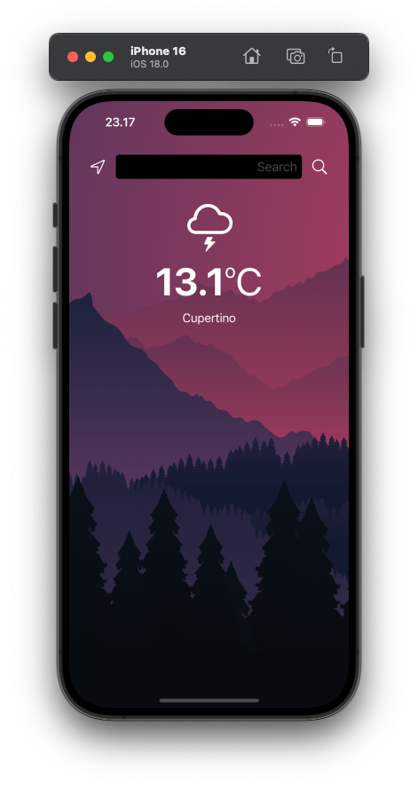

# Weather Ku
this is a project playground for me learning ios development specifically in dark mode, networking, parsing json, delegate pattern, fetch location with swift programming language

# Screenshots

